# Tiki Lounge

Six puzzles. One lounge.

A free offline puzzle bundle for iPhone. You play, you earn points, you decorate Vic's bar. The room grows with you. No account. No forced daily login. Open it on a plane.

[Website](https://tiki-lounge.vercel.app/) · iPhone · Offline · Free

<p align="center">
  
</p>

## The games

The home screen is a hanging-sign rail. Swipe. Lounge and the boards sit to the left of Luau. Cold start lands on Luau.

<p align="center">
  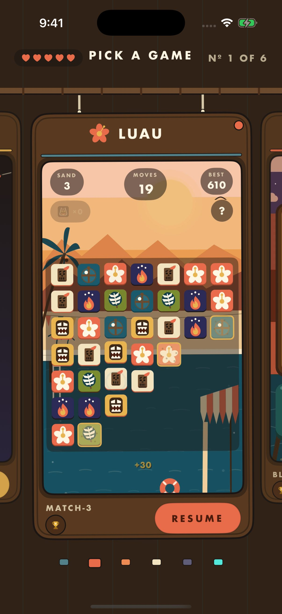
</p>

**Luau** is match-3. Swap pieces to match three or more. Specials clear big chunks of the board. This is the deep one: a 200-level campaign. The first card a new player meets.

<p align="center">
  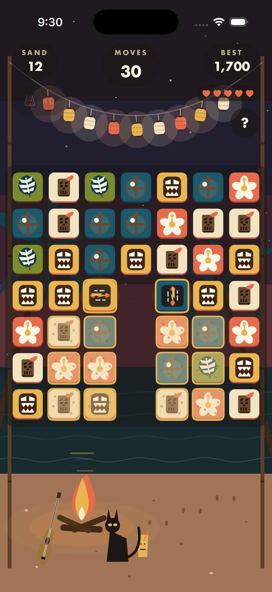
</p>

**Totem** is a block puzzle. Drop blocks. Clear full lines. The lagoon behind the board deepens the further you go.

<p align="center">
  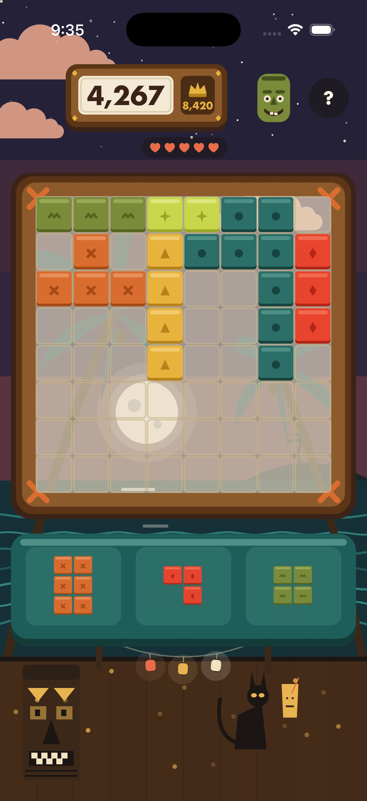
</p>

**Top Shelf** is merge, 2048-style. Swipe matching cocktails together and climb the shelf.

<p align="center">
  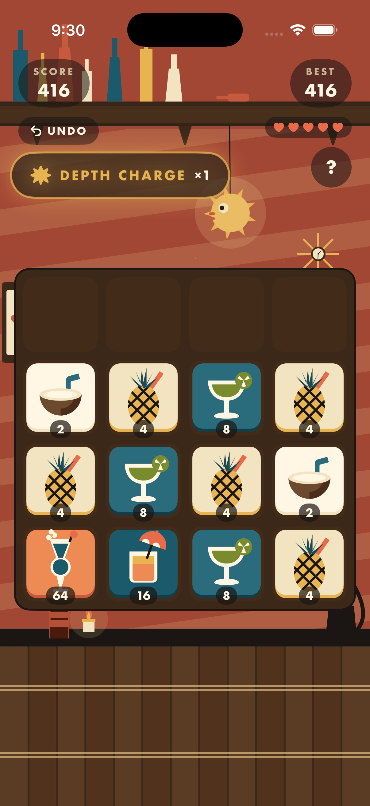
</p>

**Cabana Cipher** is a letter puzzle. Decode a phrase one letter at a time. Vic will hint if you get stuck.

<p align="center">
  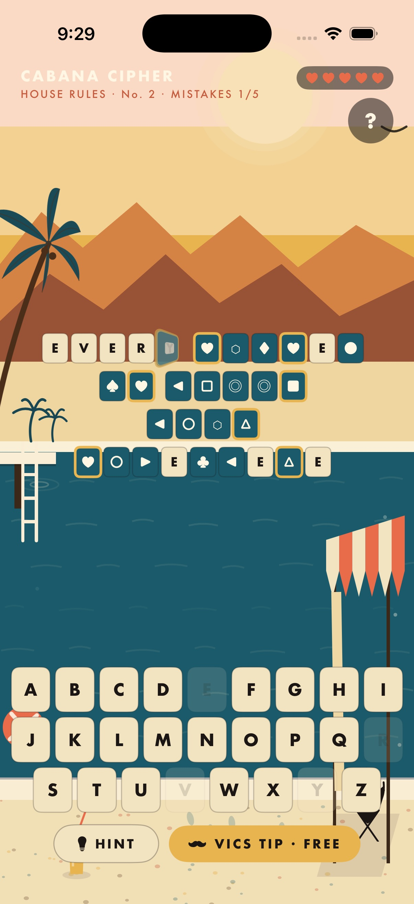
</p>

**Blueprints** is a picture grid. The numbers tell you which cells to shade. Fill it right and the picture shows up.

<p align="center">
  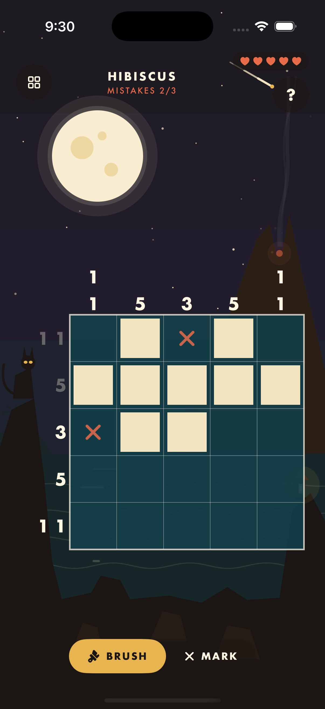
</p>

**Navigator** is memory. Watch the star pattern, then tap it back. Win and the constellation draws itself.

<p align="center">
  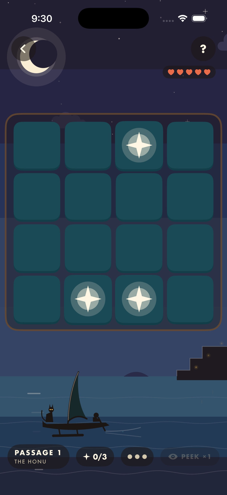
</p>

## The lounge

The lounge is the room you come home to. Winning any game pays points into one wallet. Spend them in Vic's shop and the pieces drop into the room. Drag them around. The night settles in as you go.

<p align="center">
  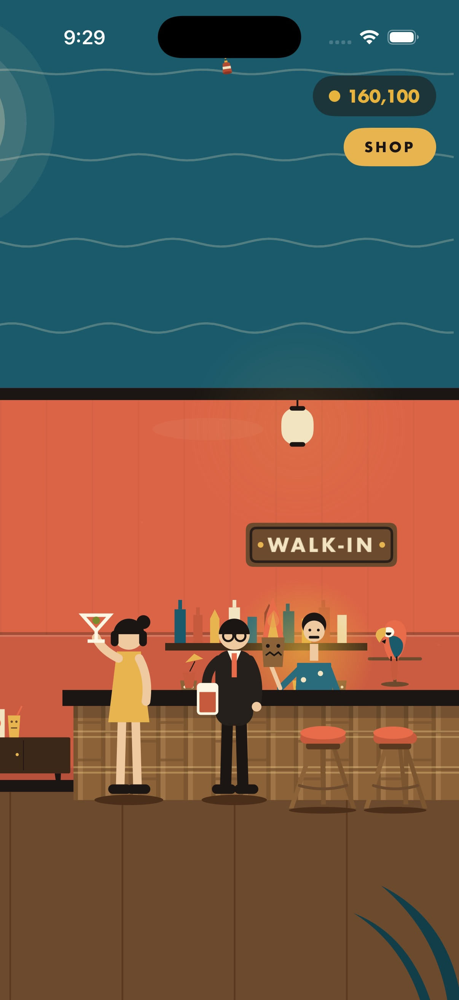
</p>

Vic is the bartender. He is always there. He runs the shop and the daily rewards.

The shop is the room, priced. A flaming mug in his hand. Fronds in the corners. The back bar. A sunset that never quite sets. A suspicious cat. Each row has Vic's line under it ("THE HOUSE POUR, ON FIRE"). Buy something and it pops into place with a spring.

## Daily rewards

Vic runs the Nightly Nine. Nine small goals each day, spread across the games. Play Luau, stack a Totem, decode a phrase. Finish any four and he pours a reward: fifty points, or a shop piece you do not own yet.

Tap Vic in the lounge to see the board. It resets every day. You do not have to finish all nine.

<p align="center">
  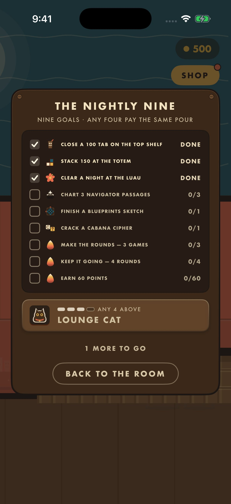
</p>

## Lives

Five hearts. One pool for every game. Lose a round, lose a heart. One heart comes back every 30 minutes, on the wall clock, even if the app is closed.

<p align="center">
  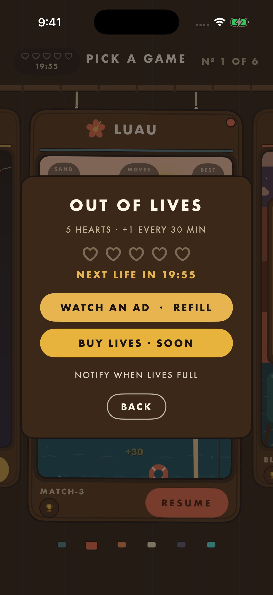
</p>

When you are empty, the out-of-lives sheet sits on the board with a live countdown. A life landing while it is open flips the sheet so you can play immediately. The tutorial does not spend a heart.

There is no buy-back. Ads and gold bars on that sheet are "coming soon" on purpose. You wait, or you come back later.

## Leaderboards

One hanging sign to the left of Luau, labeled board. That is the front door. One board per game, Game Center underneath, a themed screen on top. Totem's carved heads on the night lagoon. Top Shelf's bottles on the back bar. Luau's match-3 world. Each game has its own wardrobe.

The skeleton is the same on every board. Header, podium for the top three, plank slats for the rest, a pinned YOU bar at the bottom. Tap a row and that player's card opens. Scores queue offline and submit when you are back on the network.

You can play the whole app without signing in. The boards just wait.

<p align="center">
  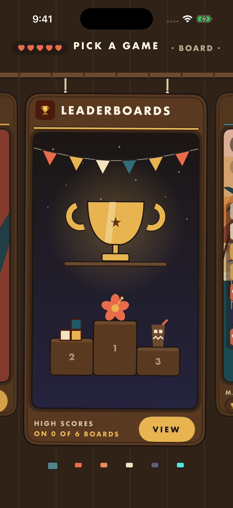
</p>

## Custom assets

Everything on screen is original flat-vector illustration. Mid-century, hard geometric shadows, no gradients. Sunset coral, lagoon teal, bamboo cream, driftwood, torchlight. Night shifts to twilight indigo and midnight lagoon.

The site uses the same hanging signs as the home screen, and a web port of Totem's lagoon behind the rail.

## What's in here

```
TikiGames/   the iPhone app
index.html   the landing page (https://tiki-lounge.vercel.app/)
```

## Status

On the App Store as **Tiki Lounge: Offline Games**. The lounge and all six games are on the rail.

## License

All rights reserved. The app is the product. Ask before you ship a copy of it.
