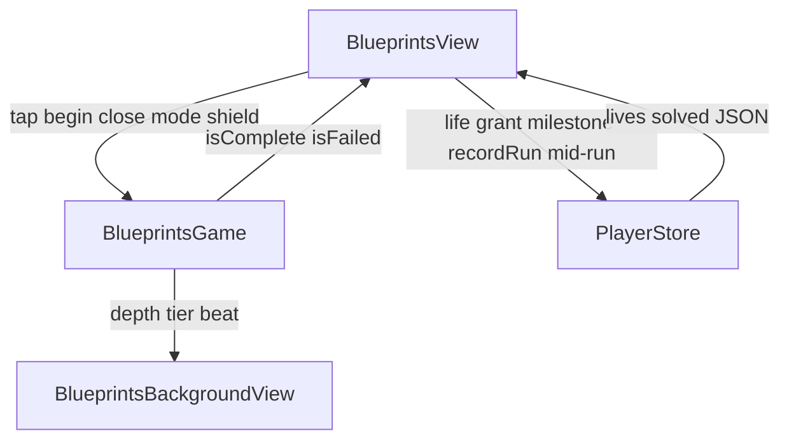

# Blueprints — Code anatomy

Player-facing name: **Blueprints**. Engine/id: **`blueprints`** / route `"blueprints"`.

Primary sources (~2.4k LOC app modules):

| File | ~LOC | Role |
|------|------|------|
| `BlueprintsView.swift` | 1260 | UI: picker, board, coach, DRAFTED / TOO MANY MISTAKES, helpers |
| `BlueprintsGame.swift` | 664 | Pure nonogram engine (bitmaps, clues, sketch taps, fail/complete) |
| `BlueprintsBackgroundView.swift` | 523 | Volcanic cove scenery driven by `ProgressPhase` |

Tests: `BlueprintsAdversarialTests.swift` (clue algebra, tutorial safety, sketch semantics, score floor, restore).  
Onboarding: `BLUEPRINTS_ONBOARDING_RUBRIC.md`.  
Assets: `BlueprintsIcon`, preview poster/video for picker.

---

## 1. Product shape in one paragraph

**Blueprints** is a **casual nonogram (Picross) drawer** over a volcanic cove. Each puzzle is an authored tiki **pixel-art bitmap** (`.` empty, `#` primary fill, `+` accent fill); **row/column run-length clues** derive from truth, so every sheet is valid by construction. **BRUSH** paints fills; **MARK** crosses empties. Wrong brush on a false cell **auto-crosses and costs a mistake**; wrong mark on a true cell **auto-fills and costs a mistake**. **3 mistakes** ruin the sketch (**TOO MANY MISTAKES**). A puzzle is **DRAFTED** when every true cell is filled — the grid **colorizes** into the picture. Content is a **30-sheet drawer**: **5×5** warm-ups (5), **8×8** mains (14), **10×10** spotlights (11). First solves pay full wallet score; **replays pay ¼**. Milestones at **5 / 15 / 30** drafted. First-run coach: **17 scripted beats** on the **Tiki Mug** (read full-line → run → earn marks → cash stacked clue → generalize `1 1 1`), with a **MARK intro** button teach.

Wallet: solved sketch → `recordRun(score: completionScore)`; ruined sketch → life only, **no** `recordRun`.

---

## 2. File / type hierarchy

```
ContentView (route .blueprints / "blueprints")
└── BlueprintsView
    ├── @Environment PlayerStore
    ├── @State BlueprintsGame
    ├── BlueprintsBackgroundView(phase)
    ├── picker (2-col grid of puzzle cards)     // when puzzle == nil
    ├── boardScreen (clues + grid + BRUSH/MARK) // when puzzle open
    ├── draftedOverlay (DRAFTED!)
    ├── failedOverlay (TOO MANY MISTAKES)
    ├── CoachCard / READY TO DRAFT / HowToPlay
    ├── mistake toast / lives education / OutOfLives / Leaderboard
    ├── PixelArtView / BlueprintColors
    ├── CoachCapsulePulse / CoachGroupRing / ClueSpotlight
    └── modeToggle / soloMarkIntro

BlueprintsGame (@Observable)
├── Cell / Mode / Puzzle / ClueRef / TutorialBeat
├── puzzles[30] + tutorialBeats[17]
├── clues / rowClues / colClues / rowSatisfied / colSatisfied
├── begin / closePuzzle / tap → sketchTap
├── evaluateFailure / checkComplete / completionScore
├── coachShield / setCoachShield
└── SavePayload payload / restore

PlayerStore.blueprints
├── mid-run JSON (solved IDs + live grid/mistakes)
├── milestone bits 11–13 (5 / 15 / 30 drafted)
├── spendLifeForDefeat on ruin
└── recordRun only on draft complete
```

### Ownership rule

| Concern | Owner |
|---------|--------|
| Bitmap truth, clues, fill/cross semantics, fail/complete, score formula | `BlueprintsGame` |
| Drag paint, coach beats/MARK intro, picker, overlays, Vic-style toast | `BlueprintsView` |
| Lives, wallet, milestones, mid-run JSON | `PlayerStore` (+ view timing) |
| Cove / constellations / moon-glow | `BlueprintsBackgroundView` + `ProgressPhase` |

Engine **never** spends lives or grants points. Engine **does** own `coachShield` so scripted mistakes never trip the cap.

---

## 3. Code blocks in `BlueprintsGame.swift`

### 3.1 Types & constants

| Block | Role |
|-------|------|
| `mistakeCap` | **3** — third wrong cell ruins the draft |
| `Cell` | `empty` / `filled` / `crossed` (Codable) |
| `Mode` | `fill` (BRUSH) / `cross` (MARK) |
| `Puzzle` | `id`, `name`, `rows: [String]`; `size`; `truth` (`#` or `+`); `isAccent` (`+`) |
| `tutorialPuzzleIndex` | **0** — Tiki Mug |
| `ClueRef` | `.row(Int)` / `.col(Int)` — coach spotlight target |
| `TutorialBeat` | `row`, `col`, `mode`, `message`, `clue` |
| `tutorialBeats` | **17** scripted cells on the mug |
| `puzzles` | **30** authored squares |

### 3.2 Puzzle drawer (content unit)

| Size | Count | IDs (order in table) |
|------|-------|----------------------|
| **5×5** | 5 | mug, hibiscus, anchor, pineapple, umbrella |
| **8×8** | 14 | mask, palm, cat, martini, float, ukulele, crab, idol, vinyl, outrigger, lantern, shell, moonrise, skull |
| **10×10** | 11 | volcano, torch, blowfish, turtle, kraken, sunset, castaway, compass, island, totem, starfish |

Bitmap alphabet: `.` empty · `#` primary · `+` accent (truth + colorize).

### 3.3 Observable / session state

| Field | Role |
|-------|------|
| `puzzle` | Open sheet (`nil` = picker) |
| `grid` | `[[Cell]]` square; left populated after `closePuzzle` (teardown-safe) |
| `mistakes` / `mistakeBeat` / `fillBeat` | Cap + juice keys |
| `isComplete` / `isFailed` | Terminal sketch states |
| `solvedIDs` | Career set of drafted puzzle ids (persisted) |
| `mode` | Active tool (view/coach also set) |
| `coachShield` | Blocks `evaluateFailure` while coach owns mug |
| `completedFirstSolve` | Set on complete: first time this id vs replay |
| `lastRunSummary` | Filled by view after `recordRun` |

### 3.4 Clues (MARK: clues)

```
clues(for: [Bool]) → [Int]
  run-length of true cells; empty line → [0]

rowClues(r) / colClues(c)
  derived from puzzle.truth (authored bitmap)

rowSatisfied(r) / colSatisfied(c)
  run pattern of filled cells on grid equals clue pattern
  → dim clue label (picross breadcrumb)
```

### 3.5 Play (MARK: play)

```
begin(p, resuming?, mistakes)
  reject ragged (non-square) puzzles
  restore grid if shape matches; else empty grid, mistakes 0
  mode = .fill; clear complete/failed/summary
  if resumed: checkComplete(); always evaluateFailure()

closePuzzle()
  puzzle = nil; clear terminal flags
  KEEP grid (ForEach teardown safety)

tap(r,c) → Bool
  guard live board + in bounds
  → sketchTap

sketchTap (casual Picross):
  if cell == crossed && mode == cross → erase to empty
  guard cell == empty else no-op
  fill mode:
    truth → filled; fillBeat++; checkComplete
    false → crossed; mistakes++; evaluateFailure   // auto-correct
  cross mode:
    truth → filled; mistakes++; evaluateFailure; maybe checkComplete  // auto-correct
    false → crossed

evaluateFailure()
  if !coachShield && !isComplete && mistakes >= 3 → isFailed

checkComplete()
  every truth cell filled → completedFirstSolve = !solvedIDs.contains(id)
  isComplete = true; solvedIDs.insert(id)
```

### 3.6 Scoring

```
completionScore = max(20, size*size*4 - mistakes*10)
```

| Board | Perfect | Examples |
|-------|---------|----------|
| 5×5 | 100 | mug first clear |
| 8×8 | 256 | |
| 10×10 | 400 | |
| Floor | 20 | tiny/empty edge cases |

**Wallet (view on complete):**

| Layer | Pay |
|-------|-----|
| First solve | `recordRun(score: completionScore)` → wallet `score/10` |
| Replay | `earnScore: max(10, completionScore/4)` |
| Milestones | bits **11–13** at **5 / 15 / 30** `solvedIDs.count`; each mint **+75** once |

Ruin: **no** `recordRun`.

### 3.7 Tutorial beats (17) — deduction ladder

Script on **Tiki Mug** (`#####` middle row, etc.). Phases:

| Phase | Beats (approx) | Mode | Message atom |
|-------|----------------|------|--------------|
| READ | row2 cols 0–4 (5 fills) | fill | ROW SAYS 5 — DRAG ACROSS ALL FIVE |
| RUN | row0 cols 1–3 (3 fills) | fill | ROW SAYS 3 — FILL ITS RUN OF THREE |
| EARN | row0 cols 4,0 (2 crosses) | cross | THE 3 IS DONE — CROSS OFF THE REST |
| CASH | (1,1) fill; (3,1) cross; (4,1) fill | mix | col 1 stacked `3 1` |
| GENERALIZE | row3: fill, fill, cross, fill | mix | 1 1 1 — THREE SINGLES… |

Every fill target is true; every cross target is forced empty at fire time (adversarial tests pin this). Script leaves mug **unfinished** — remainder uses taught atoms only.

### 3.8 Persistence

| API | Role |
|-----|------|
| `SavePayload` | `seenHowTo`, `solved: [String]`, `currentID?`, `currentGrid?`, `currentMistakes?`, `mistakeHint?` |
| `payload(seenHowTo:mistakeHint:)` | Live only if `!isComplete && puzzle != nil` (failed stays live so kill can't launder mistakes) |
| `restore(from:)` | Reload `solvedIDs`; `begin` open puzzle if `currentID` matches table |

### 3.9 DEBUG seeds

| Hook | Effect |
|------|--------|
| `debugSeedSolved(n)` | First *n* puzzle ids in `solvedIDs` |
| `debugStageMistakes(n)` | Stage counter; may arm `isFailed` |

---

## 4. Code blocks in `BlueprintsView.swift`

### 4.1 Body ZStack (bottom → top)

1. `BlueprintsBackgroundView`  
2. `boardScreen` **or** `picker`  
3. `draftedOverlay` if complete  
4. `failedOverlay` if failed  
5. Lives education toast (z 95)  
6. `OutOfLivesSheet` (z 100)  
7. `LeaderboardView` (z 90)  
8. `CoachCard` (mug + coach + not terminal)  
9. `TutorialReadyBanner` **"READY TO DRAFT"**  
10. `HowToPlayPanel` **"HOW TO DRAFT"**  

### 4.2 View-local state

| State | Role |
|-------|------|
| `howToOpen` / `seenHowTo` | Rules panel + first-run flag |
| `mistakeHintShown` / `mistakeToastActive` | JIT "WRONG CELL — MARKED FOR YOU" |
| `shake` | Wrong-tap board offset |
| `coachActive` / `tutorialBeat` / `markIntroduced` | 17-beat coach + MARK tool teach |
| `readyBannerActive` | Post-success coach dismiss |
| `mintedThisSolve` | Milestone toast on DRAFTED |
| `leaderboardOpen` / `boardStandings` | GC bar |
| `outOfLivesOpen` / spend-break / `livesEducationActive` | Shared lives UX |
| `defeatHandled` | Single life spend per ruin |
| `blockedPuzzle` | Picker open gated by OutOfLives |
| `lastPainted` / `dragIntent` | Drag-paint semantics |

### 4.3 MARK sections

| Section | Role |
|---------|------|
| lifecycle | `start`, restore, coach pin, persist, DEBUG |
| coach | message, MARK intro, targets, phase cells, advance, dismiss |
| play | `tapCell`, finish-on-complete, `handleDefeat`, retry |
| picker | drawer grid + `puzzleCard` |
| board | chrome, clue rails, `grid` drag, `cellView`, mode toggle |
| defeat | `failedOverlay` |
| completion | `draftedOverlay` |
| helpers | `CoachCapsulePulse`, `CoachGroupRing`, `ClueSpotlight`, `PixelArtView`, `BlueprintColors` |

### 4.4 Scene phase → background

```
scenePhase = ProgressPhase(
  tier: 1 + solvedIDs.count / 3,   // constellation ladder (0 = legacy four)
  beat: solvedIDs.count,           // shooting star on first-solve count
  depth: filledTruth / totalTruth  // moon-glow as open puzzle fills
)
```

### 4.5 Coach (17 beats + MARK intro)

```
start (first run, !seenHowTo, !onboardingSkipped):
  begin(mug) if needed
  tutorialBeat = firstPendingBeat(from: 0)   // skip already-satisfied
  markIntroduced = tutorialBeat > 9
  auto-set mode for fill beats; park on first cross until MARK pressed
  coachActive + coachShield

awaitingMarkIntro:
  card: "THE 3 IS DONE — HIT MARK BELOW"
  soloMarkIntro button (pulsed) instead of full toggle
  introduceMark() → mode=.cross, markIntroduced, resync pending beat

coachTargetCell / coachPhaseCells / coachClue:
  primary pulse + quiet rings on same-message pending cells
  clue rail spotlight (ClueSpotlight)

advanceTutorial after on-target successful tap (no new mistake)
  firstPendingBeat flows past drag-ahead / auto-corrects
  last → dismissCoach(success) → READY TO DRAFT

SKIP → onboardingSkipped, no READY banner
solve mug mid-script → silent coach retire (DRAFTED owns moment)
```

### 4.6 Tap / drag path

```
grid DragGesture(minDistance: 0)
  map location → (r,c); reject off-board before Int trunc
  first cell: full-cell hit
  subsequent: only inner 70% (anti-overshoot)
  dragIntent = first cell's state; only paint matching state
  → tapCell(r,c)

tapCell:
  game.tap
  if coach on-target and no new mistake → advanceTutorial
  if new mistake → haptic + shake + maybe mistake toast
  if failed → handleDefeat
  else if complete → (retire coach if any) win SFX → milestones → recordRun
  persist
```

### 4.7 Finish / defeat / picker

```
on complete (inside tapCell):
  milestones [5,15,30] → bits 11+i
  recordRun(score, earnScore: first ? nil : max(10, score/4))

handleDefeat:
  once; gameOver SFX; spendLifeForDefeat(duringTutorial: coach)
  NO recordRun

retryAfterGate:
  begin(same puzzle) clean board

picker card:
  if out of lives → OutOfLives + blockedPuzzle
  else begin(puzzle)

NEXT BLUEPRINT / drawer button:
  closePuzzle → picker
```

### 4.8 Overlays (player-facing copy)

| Overlay | Title | Why / body | CTA |
|---------|-------|------------|-----|
| Complete | **DRAFTED!** | Pixel art reveal; PERFECT DRAFT / MISTAKES n / REDRAFT | **NEXT BLUEPRINT** |
| Defeat | **TOO MANY MISTAKES** | THREE WRONG CELLS ENDED THE DRAFT | **PLAY AGAIN** / ALL GAMES |
| How-to | **HOW TO DRAFT** | runs · BRUSH · MARK (3 rules) | dismiss |
| Ready | **READY TO DRAFT** | Post-coach | dismiss |
| JIT | WRONG CELL — MARKED FOR YOU | First wrong fill | auto |

### 4.9 Board chrome & tools

- Clue rails: left row clues (joined), top stacked col digits; satisfied dim to 0.32  
- 5-block separators on boards n ≥ 10 (stride 5)  
- Cells: cream fill while drafting; colorize primary/accent on complete; coral xmark when crossed  
- **BRUSH / MARK** capsule toggle; coach pre-MARK uses **soloMarkIntro** only  

### 4.10 Helpers (file-level)

| Type | Role |
|------|------|
| `CoachCapsulePulse` | Pulsed MARK intro button |
| `CoachGroupRing` | Quiet rings on phase siblings |
| `ClueSpotlight` | Torch pulse on reasoned clue label |
| `PixelArtView` | Colorized mini bitmap; optional diagonal reveal wave |
| `BlueprintColors.for(id)` | Per-puzzle (primary, accent) palette |

---

## 5. Code blocks in `BlueprintsBackgroundView.swift`

### 5.1 Shell

| Piece | Role |
|-------|------|
| `BlueprintsBackgroundView` | Timeline clock + `DepthDial`; `beatAt` on solve beat |
| `BlueprintsScene` | Deep-night volcanic cove |

### 5.2 Scene stack (back → front)

```
sky → stars → constellations → shootingStar → moon
→ ocean → headland → volcano → smoke → ledge → lantern → cat
```

### 5.3 Phase mapping

| Input | Visual |
|-------|--------|
| `depth` 0…1 | Fraction of open puzzle true cells filled → moon-glow floor |
| `tier` | `1 + solved/3` constellation groups hung (tier 0 = legacy four) |
| `beat` / `beatAt` | Shooting star on first-solve counter |
| 90s breath | Twilight ↔ deepest night cycle |

Darkest / calmest of the five lounge scenes.

---

## 6. Timeline — full lifecycle

### A. Enter (`start`)

```mermaid
sequenceDiagram
  participant V as BlueprintsView
  participant G as BlueprintsGame
  participant S as PlayerStore
  V->>G: restore(loadState blueprints)
  alt first run and not onboardingSkipped
    V->>G: begin(mug)
    V->>V: coachActive, shield, firstPendingBeat
  else mid-sketch restore
    Note over G: resume grid; re-arm isFailed if ruined
  else picker
    Note over V: puzzle nil → drawer
  end
  V->>S: persist
```

### B. Coach (17 beats)

```
READ full row 5 → RUN of 3 → EARN crosses (after MARK intro)
  → CASH col 3 1 → GENERALIZE 1 1 1
  → READY TO DRAFT (or SKIP silent)
Drag-ahead / auto-cross: firstPendingBeat skips satisfied
```

### C. Real play loop

```
picker → open puzzle (life gate)
  → BRUSH/MARK + drag/tap
  → wrong: auto-correct + mistake (toast once)
  → 3 mistakes: isFailed → handleDefeat → TOO MANY MISTAKES
  → all truth filled: isComplete → DRAFTED + wallet
  → NEXT BLUEPRINT → picker
  → mid-run persist after every tap
```

### D. DRAFTED path

```
milestones → recordRun (¼ if replay)
panel PixelArt reveal → NEXT BLUEPRINT → closePuzzle
constellations update via solvedIDs / 3
```

### E. TOO MANY MISTAKES path

```
3rd wrong → isFailed → life spend (no wallet)
panel → PLAY AGAIN (same id, clean) or ALL GAMES
kill mid-defeat: restore re-arms fail; defeatHandled skips double spend
```

---

## 7. Mental model



**Round definition:** a **drafted sketch** is a scored run; a **ruined sketch** is a life loss only.

---

## 8. Staging / DEBUG env hooks

| Env | Effect |
|-----|--------|
| `TIKI_BLUEPRINTS_SOLVED=<n>` | Seed n drafted sheets |
| `TIKI_PUZZLE=<id>` | Open specific blueprint |
| `TIKI_BLUEPRINTS_MISTAKES=<n>` | Stage mistake counter |
| `TIKI_AUTOPLAY=1` | Auto-draft first unsolved (2 deliberate wrongs) |
| `TIKI_BLUEPRINTS_CLEAN=1` | Autoplay zero mistakes |
| `TIKI_BLUEPRINTS_HOLD=<k>` | Stop with k true cells left |
| `TIKI_BLUEPRINTS_TUTORIAL_AUTOPLAY=1` | Walk coach beats + MARK intro |
| `TIKI_LB=1` | Force leaderboard |

---

## 9. How-to rules (shipped copy)

1. Each number is a run of filled cells, in order — `1 2 1` means single, gap, pair, gap, single.  
2. BRUSH paints sure cells; wrong fills cost a mistake and mark themselves — three ruins the sketch.  
3. MARK flags cells that must stay empty; finish the picture to colorize.

---

## 10. Related docs

| Doc | Use |
|-----|-----|
| `BLUEPRINTS_ONBOARDING_RUBRIC.md` | Coach quality bar |
| `TOTEM_ANATOMY.md` / `LUAU_ANATOMY.md` / `TOP_SHELF_ANATOMY.md` / `CIPHER_ANATOMY.md` | Sibling format |
| `DOCUMENTATION.md` | Project index |
| Tests | `BlueprintsAdversarialTests.swift` |

---

*Generated from iOS source (`BlueprintsGame` / `BlueprintsView` / `BlueprintsBackgroundView`). Update alongside those files when behavior changes.*
