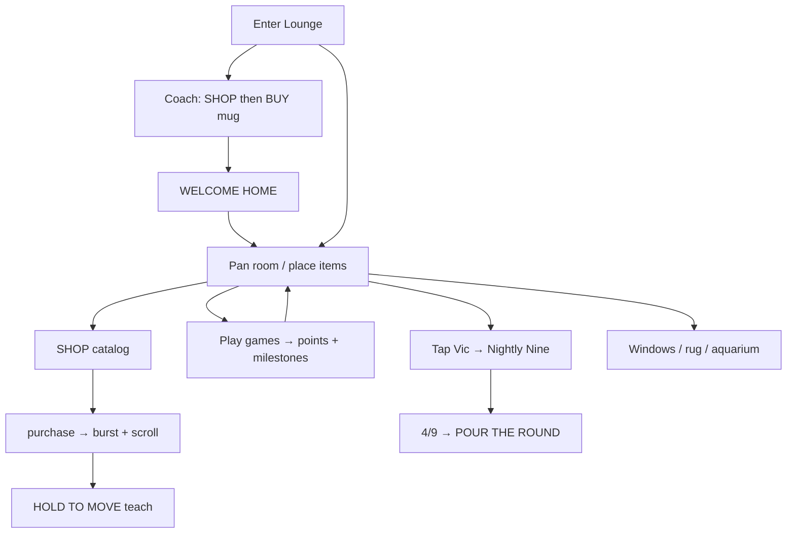
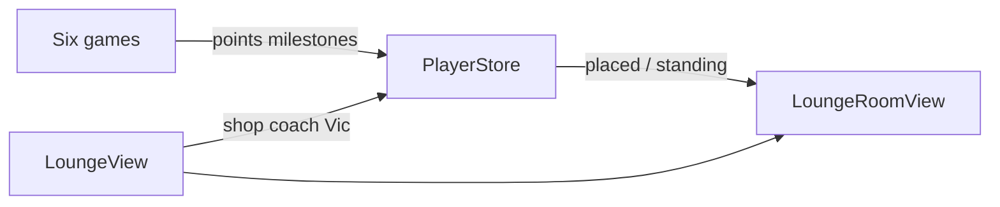

# The Lounge — Code anatomy

Player-facing name: **The Lounge**. Route: **`.lounge`** / `"lounge"`.  
Not a “game” in the six-game grid — it is the **meta-destination**: spend wallet points, place furniture, claim Nightly Nine, express windows/rug.

Primary sources:

| File | ~LOC | Role |
|------|------|------|
| `LoungeView.swift` | 2805 | Shell, shop, coach, missions, room composition |
| `LoungeItemSprites.swift` | 69 | `HouseStandingPlaque` engraving |
| `PlayerStore.swift` | (shared) | Catalog, purchase, placement, Nightly Nine, standing |
| Assets | — | `LoungeScene`, `Sprites/*`, lagoon sprites |

Plans/rubrics (product, not runtime): `LOUNGE_PLAN.md`, `LOUNGE_V2_PLAN.md`, `LOUNGE_RUBRIC.md`, `LOUNGE_V2_RUBRIC.md`.

---

## 1. Product shape in one paragraph

The Lounge is a **2.2-screen-wide mid-century tiki bar** panned horizontally (camera opens on the **east bar**). A nearly empty room fills as the player **buys catalog items with points** earned from games. Owned pieces can be **hold-dragged** along the floor (cx + depth). **Vic** behind the bar is the door to **THE NIGHTLY NINE** (daily missions); four of nine done unlocks **POUR THE ROUND**. **House Standing** (WALK-IN → NAME ON THE DOOR) comes from milestone bit count and seats “regulars” on furniture. Windows and rug are **expression** taps; the aquarium stocks fish from top milestones; the neon Sign unlocks after the launch-five first rungs.

---

## 2. Hierarchy

```
ContentView (route .lounge / picker slot .lounge)
└── LoungeView
    ├── @Environment PlayerStore
    ├── @State LoungeModel (shopOpen, justPlaced)
    ├── room bed (static bands)
    ├── ScrollViewReader → horizontal ScrollView (2.2× width world)
    │   └── TimelineView (30 fps ambient clock)
    │       └── LoungeRoomView (full interior)
    ├── overlayChrome (PointsChip + SHOP)
    ├── shopPanel
    ├── CoachCard / WELCOME HOME banner
    ├── missionsCard (Nightly Nine)
    ├── toasts (regulars, nightly hint, expand, pour caption)
    └── bottle / move-hint CoachCards

LoungeRoomView (private)
├── edgeBleed, wall, wallDressing, ceiling
├── lagoonLife (water scene purchases)
├── dustMotes, floorAndRug, ghostHooks
├── standingPlaque (HouseStandingPlaque)
├── hangingLayer, vic, bar, standingItems
├── purchaseBurst (LoungeBurst)
└── scrollMarkers (zone + item ids)

PlayerStore
├── LoungeItem @Model catalog (upsert each launch)
├── placedItemIDs / itemPositions / itemDepths
├── purchase / setItemPosition / setItemDepth
├── houseStanding / houseStandingTier / signUnlocked / aquariumFish
├── Nightly Nine state + claimNightlyReward
└── windowViewEast/West, rugColorway
```

### Ownership

| Concern | Owner |
|---------|--------|
| Catalog, points, place/buy, nightly, standing | `PlayerStore` + SwiftData |
| Shop UI, coach, toasts, missions card | `LoungeView` |
| Anchors, drag, z-order, ambient art | `LoungeRoomView` |
| Engraved plaque look | `HouseStandingPlaque` |
| Sprite Image lookup | `LoungeSprites` |

---

## 3. Code blocks in `LoungeView.swift`

### 3.1 Shell state

| Block | Role |
|-------|------|
| `coachStep: LoungeCoachStep?` | `.shop` → `.buy` FTUE |
| `readyBannerActive` | **WELCOME HOME** after successful coach |
| `moveHintActive` / `moveHintWiggle` | Hold-to-move teach + hop demo |
| `regularsToastActive` | “THE REGULARS FOUND THE GOOD SEATS” |
| `expandToastActive` | “PLAY THE GAMES TO EXPAND YOUR LOUNGE” |
| `dailyReward` | Vic pour float + caption |
| `missionsOpen` | Nightly Nine board |
| `nightlyHintActive` | “DAILY GOALS · TAP VIC” |
| `bottleNote` | Rotating bottle notes (UserDefaults index) |
| `shopScrollTarget` | Ghost-tap opens shop to row |
| `movableIDs` | Pieces that accept hold-drag |
| `LoungeModel` | `shopOpen`, `justPlaced` (survives view identity) |

### 3.2 Body ZStack (bottom → top)

1. Static lagoon/ink/coral/driftwood **overscroll bands**  
2. Horizontal **ScrollView** world (`worldScreens = 2.2`), default anchor **trailing** (bar)  
3. `LoungeRoomView` under **TimelineView** 30 fps (Reduce Motion pauses clock)  
4. `overlayChrome` (points + SHOP)  
5. `shopPanel` if open  
6. Coach / READY / toasts / missions / bottle  

### 3.3 Coach (2 beats)

| Beat | Message | Advance |
|------|---------|---------|
| `.shop` | GRAB VIC'S WELCOME MUG | Open shop (or card tap → gift id) |
| `.buy` | ON THE HOUSE | Purchase welcome mug |

Success → `loungeOnboardingSeen` + **WELCOME HOME**. SKIP → `onboardingSkipped` (bundle-wide). Mug placement always success-dismisses if coach still up.

### 3.4 Shop

| Block | Role |
|-------|------|
| `shopPanel` | Full-screen catalog list, owned count, close |
| `shopRow` | Thumb, price, OWNED / BUY / lock copy for Sign |
| `buy(_:)` | `store.purchase` → haptic → `justPlaced` → close shop → move hint / regulars / expand toast |
| Ghost hooks | Unowned anchors open shop scrolled to id |

### 3.5 Nightly Nine

| Block | Role |
|-------|------|
| `openMissions` | Tap Vic → board card |
| `missionsCard` | Nine fixed challenges + progress |
| `nightlyReady` | completed ≥ 4 && !claimed |
| `claimAndPour` | `claimNightlyReward` → float + caption → optional rating ask |
| Entry tasks | `refreshNightlyMirrors`; once-ever “tap Vic” hint |

Challenges (ids stable): topShelf500, totem150, luauNight, navigator3, blueprintsSketch, cipherPhrase, rounds3, busy4, wallet60. Goal **4/9**; default pour **50** points (comps can vary by `NightlyReward`).

### 3.6 Expression & placement (store calls)

| API | Role |
|-----|------|
| `cycleWindow(east:)` | Cycle unlocked window views |
| `cycleRug()` | Cycle rug colorway 0…n |
| `commitPlacement` | `setItemPosition` + `setItemDepth` |
| `resetPlacements` | Tidy (debug / confirm path) |

### 3.7 Discovery / ambient UX

| Beat | Trigger |
|------|---------|
| West-wing pan hint | First time west content owned, drift mid then home |
| Move hint | First movable purchase or furnished-room entry (v2 key) |
| Regulars toast | Couch@tier≥1 or highTable@tier≥2 |
| Bottle notes | Tap bottle; rotates `bottleNotes` |

### 3.8 DEBUG / staging env

`TIKI_LOUNGE_ZONE`, `TIKI_BUY_LATE`, `TIKI_LOUNGE_PAN`, `TIKI_GHOST_TAP`, `TIKI_WINDOW`, `TIKI_RUG`, `TIKI_PLACE`, `TIKI_TIDY`, `TIKI_PROPORTION_AUDIT`, `TIKI_NIGHTLY`, `TIKI_NIGHTLY_OPEN`, `TIKI_NIGHTLY_CLAIM`, `TIKI_SHOP`, `TIKI_FTUE_AUTO`, …

---

## 4. Code blocks in `LoungeRoomView`

### 4.1 World constants

| Symbol | Role |
|--------|------|
| `worldScreens` | **2.2** — pan width multiplier |
| `itemScale` | Shared scale for many props |
| `ceilingLine` | Fan hang band |
| Anchor frames | Designed cx/width/aspect from LoungeScene hero |

### 4.2 Layer stack (back → front)

```
edgeBleed → wall → wallDressing → ceiling → lagoonLife → dustMotes
→ floorAndRug → ghostHooks → standingPlaque → hangingLayer
→ vic → bar → standingItems → purchaseBurst → scrollMarkers
```

### 4.3 Drag placement

| Block | Role |
|-------|------|
| `Lift` | Active drag id + offsets |
| `liftDrag` | Long-press lift → horizontal cx + vertical depth |
| `movableImage` | Lift scale + ground shadow while held |
| `depthEligible` | Which ids accept depth > 0 |
| `cx` / `depth` / `floorFrame` | Resolve stored or default anchors |

### 4.4 Zones of content

| Layer | Examples |
|-------|----------|
| Ceiling / hang | fan, marlin, sign, aquarium, lamp, float, shelf |
| Bar | Vic, stools, mug, trophy (Zombie bit 7), drink |
| Floor | statue, palm, cat, credenza, patrons, plants, rug, couch, piano, table |
| Lagoon | buoy, duck, bottle, dolphin, turtle, boat, shark, orca, island, volcano, yacht |
| Fixed fixtures | windows, parrot, gift mug slot (not movable) |

### 4.5 Helpers

`LoungeBurst`, `HangingSprite`, `DailyPourFloat`, `runProportionAudit()` (DEBUG).

---

## 5. PlayerStore lounge economy

### 5.1 `LoungeItem` model

`itemID`, `name`, `price`, `purchasedAt?`, `isPlaced`, `posX` (−1 = default), `posDepth` (0…1).

### 5.2 Catalog (upserted every launch)

Rough ladder (id → price): flamingMug 50 … yacht 5000 — **~35** items including west wing + lagoon set.  
Welcome gift: `welcomeGiftItemID` (flaming mug path) **on the house** once.

### 5.3 Standing & unlocks

| Metric | Rule |
|--------|------|
| `houseStanding` | bitCount &lt;5 WALK-IN · &lt;10 REGULAR · &lt;15 ISLANDER · else NAME ON THE DOOR |
| `houseStandingTier` | 0…3 from same thresholds (patron seating) |
| `signUnlocked` | Launch five games each have any milestone bit |
| `aquariumFish` | 1 + count of top bits {3,7,10,13,17}, max 5 |
| Zombie trophy mug | milestone bit 7 on zombie (not sold) |

### 5.4 Purchase

```
purchase(id) → false if owned/unknown/locked Sign/can't afford
  (except welcome gift while unclaimed)
  deduct points → isPlaced → placedItemIDs insert
```

---

## 6. Timeline



### A. Enter
Restore placed set / positions. Coach if `!loungeOnboardingSeen`. Ambient clock starts. Discovery pan / move-hint / nightly-hint tasks may fire after delays.

### B. FTUE
SHOP beat → open shop → BUY beat → free mug → coach success → WELCOME HOME → expand toast.

### C. Live room
Pan west–east; ghost-tap unowned; buy places + burst; long-press move; windows/rug cycle; bottle notes.

### D. Nightly
Play games update mirrors → Vic glows at 4/9 → open board → POUR → reward float → maybe rating ask.

### E. Progression loop
More points → more catalog → higher standing → regulars seat → Sign / aquarium stock / lagoon life.

---

## 7. Mental model



**Round (games) vs visit (lounge):** games mint wallet; lounge spends and displays progress.

---

## 8. Related docs

| Doc | Use |
|-----|-----|
| `LOUNGE_V2_PLAN.md` / `LOUNGE_V2_RUBRIC.md` | Pan room, drag, west wing |
| `LOUNGE_PLAN.md` / `LOUNGE_RUBRIC.md` | Original destination bar |
| `*_ANATOMY.md` | Per-game oracles that feed standing bits |
| Android | `LoungeScreen` twin (if present) — iOS remains source of truth |

---

*Generated from iOS `LoungeView` / `LoungeItemSprites` / `PlayerStore` lounge APIs. Update when catalog, coach, or Nightly Nine change.*
