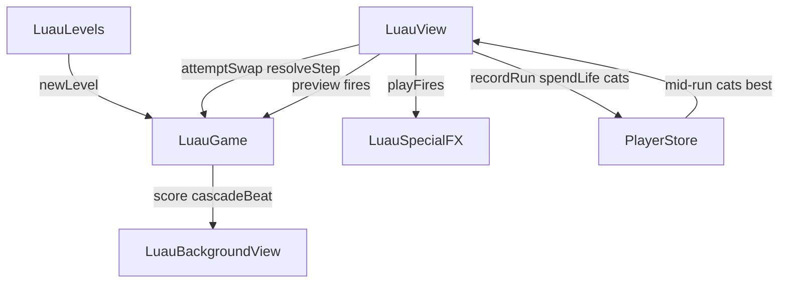

# Luau — Code anatomy

Player-facing name: **Luau**. Engine/id: **`luau`**.

Primary sources (~6.6k LOC across Luau modules):

| File | ~LOC | Role |
|------|------|------|
| `LuauGame.swift` | 1383 | Pure match-3 engine (endless + campaign) |
| `LuauView.swift` | 1666 | UI shell, gestures, coach, panels, resolution driver |
| `LuauLevels.generated.swift` | 1333 | LevelForge-emitted campaign levels |
| `LuauBackgroundView.swift` | 637 | Bonfire lagoon scenery |
| `LuauSpecialFX.swift` | 591 | Torch/cat/combo traveling FX |
| `LuauSelfTest.swift` | 296 | In-app engine probes |
| `LuauLevels.hand.swift` | 227 | Hand-authored L1–L12 teaching arc |
| `LuauBot.swift` | 184 | Greedy solver / autoplay / LevelForge |
| `LuauLevels.swift` | 126 | Campaign registry |
| `LuauLevelPicker.swift` | 123 | Night picker overlay |
| `LuauLevel.swift` | 90 | Level data model + ASCII parse |

Tests: `LuauGameAdversarialTests.swift`, `LuauLevelsAdversarialTests.swift`.  
Plans/rubrics: `LUAU_LEVELS_PLAN.md`, `LUAU_ONBOARDING_RUBRIC.md`, `LUAU_SPECIALS_FX_RUBRIC.md`.

---

## 1. Product shape in one paragraph

**Luau** is a 7×7 match-3 with six piece kinds. Drag a piece onto a neighbor to
**swap** — the swap must form a **3+ run** or a **2×2 square** (Matchington) or
it reverts; a legal whiff **still spends a move**. Cascades resolve in stepped
beats with a rising multiplier. **4-line** matches spawn a **torch** (row/col
clear special); **5+** spawn the **cat** (color bomb). Campaign **nights**
(`LuauLevel`) add a playable **mask**, **sand/jelly** to clear, a move budget,
and seeded RNG. Win: sand → 0. Lose: moves → 0 with sand left. First-run coach
is five scripted sand-pop rounds on Night 1. Shared lives/points/milestones live
in `PlayerStore`. **Endless** mode still exists in the engine; the player entry
point is the **campaign picker** (endless is not the main product path).

---

## 2. File / type hierarchy

```
ContentView (route .luau)
└── LuauView
    ├── @Environment PlayerStore
    ├── @State LuauGame
    ├── LuauBackgroundView(phase: ProgressPhase)
    ├── chrome (SAND / MOVES / BEST chips, lives, how-to, cat button)
    ├── board (pieces, jelly, drag-swap, FX layer, cat reticle)
    ├── LuauLevelPicker          // campaign entry
    ├── sunriseOverlay           // win / lose panel
    ├── CoachCard / TutorialReadyBanner / HowToPlayPanel
    ├── OutOfLivesSheet / LeaderboardView / MilestoneToast
    └── LuauSpecialFX (FXEvent / LuauFXLayer) via playFires

LuauGame (@Observable)
├── Piece / Special
├── SpecialFire + FireKind
├── level mode: LuauLevel, jelly[], RNG
├── attemptSwap / resolveStep / gravity
├── tutorial seed ladder
├── placeCat (wallet comp)
└── SavePayload / restore

LuauLevel / LuauLevels / LuauLevelPicker
LuauBot (pickMove)
LuauSelfTest / LevelForge tools
```

### Ownership rule

| Concern | Owner |
|---------|--------|
| Board legality, match, specials, jelly, score, moves | `LuauGame` |
| Drag, reject spring, cascade timing, FX sequencing | `LuauView` + `LuauSpecialFX` |
| Lives, wallet, mid-run string, cat inventory, milestones | `PlayerStore` |
| Scenery depth (FLAME/BLAZE/INFERNO) | `LuauBackgroundView` + `ProgressPhase` |
| Level catalog | `LuauLevels` (+ hand / generated) |

The engine has **no SwiftUI**. FX is previewed **before** mutation
(`previewStepFires` / `previewSwapFires`) so agents travel over live pieces.

---

## 3. Code blocks in `LuauGame.swift`

### 3.1 Types & constants

| Block | Role |
|-------|------|
| `Special` | `.none`, `.lineH`, `.lineV`, `.cat` |
| `Piece` | `id`, `kind` (0..<6 or −1 cat), `special`, `col`, `row` |
| `size` / `kinds` / `movesPerRun` | 7 / 6 / 20 |
| `depthThresholds` | 150 / 400 / 700 — FLAME / BLAZE / INFERNO (endless ladder + milestones) |
| `SpecialFire` / `FireKind` | FX payload: torchH/V, catSwap, torchCross, torchStorm, cataclysm |
| `encoreMoves` | +2 moves once at INFERNO in endless only |
| `spareMoveBonus` | 100 pts per unused move on level win |

### 3.2 Observable state

| Field | Role |
|-------|------|
| `pieces` | Board contents (sparse over mask in level mode) |
| `score` / `best` / `movesLeft` / `isOver` | Run meters |
| `lastRunSummary` | Filled by view after `recordRun` |
| `lastFires` / `fireBeat` | Latest special activations for FX |
| `clearBeat` / `lastClearCount` / `lastCascade` / `lastGain` / `lastClearCenters` | Juice for view |
| `cascadeBeat` | Count of cascade≥3 settles → scenery ember burst |
| `encoreBeat` / `encoreFired` | ENCORE toast + one-shot gate |
| `currentLevel` / `jelly` / `attemptSeed` / `completedLevels` | Campaign |
| `didWinLevel` / `lastSpareBonus` | Sunrise panel |
| `lastCombo` / `comboBeat` | FIRE CROSS / TORCH STORM / CATACLYSM banners |
| `tutorialActive` | Suppresses end, refill noise, ENCORE, best pollution |
| `shuffleBeat` | Board reshuffle when no legal swap |

### 3.3 Modes

| Mode | Entry | Win / lose | RNG | ENCORE |
|------|-------|------------|-----|--------|
| **Endless** | `newGame()` | moves → 0 | System random | Yes at 700 |
| **Level** | `newLevel(_:attempt:)` | jelly 0 = win; moves 0 + jelly > 0 = lose | SplitMix64 from `level.seed + attempt salt` | Never |

`retryLevel()` same layout, next attempt salt (CC-style).

### 3.4 Core algorithms

```
attemptSwap(a, b)
  reject if dead / no moves / non-adjacent / empty
  if both special → performComboSwap
  if either cat → color wipe + gravity + cascade=2; spend move
  else swap pieces
    if no matches → swap back, spend move, evaluateEnd (whiff can end run)
    else spend move, cascade=1; view will resolveStep loop

resolveStep()
  if isOver → false
  matches = findMatches()  // 3+ lines + 2×2 squares
  if empty:
    update best (non-tutorial); maybe shuffle; evaluateEnd; return false
  collect clear set; fire torches in matches; spawn 4-line torch / 5+ cat
  gain = clearedCount * 10 * cascade
  decrement jelly on cleared cells
  gravity + refill (respect mask / tutorial)
  cascade += 1; return true

evaluateEndCondition()
  tutorial → return
  level: jelly==0 → win + spareMoveBonus; moves<=0 → lose
  endless: moves<=0 → over

placeCat(col,row)
  gift wallet cat onto board (not a move) — UI spends luauCats
```

### 3.5 Matching rules (`findMatches`)

- Horizontal / vertical runs of **3+** same `kind` (specials participate by cell kind).
- **2×2 squares** of same kind (`isSquare = true`).
- Spawns key off **run length**, not area: square of 4 does **not** spawn a torch.
- 4-in-a-line → opposite-orientation line special at mid cell.
- 5+ → cat at mid.

### 3.6 Special × special combos (`performComboSwap`)

| Pair | Effect | Banner |
|------|--------|--------|
| torch + torch | Full row+col cross from partner | FIRE CROSS |
| cat + torch | Torch’s kind + torch’s cross | TORCH STORM |
| cat + cat | Whole board | CATACLYSM |

### 3.7 Scoring (engine)

| Event | Points |
|-------|--------|
| Cascade step clear | `clearedCount × 10 × cascade` (cascade starts 1, +1 each step) |
| Cat color wipe (swap) | `clearedCount × 20` |
| Level win spare moves | `movesLeft × 100` folded into score at latch |
| Wallet on run end (store) | View uses `earnScore: score/3` in `recordRun` |
| Milestones FLAME/BLAZE/INFERNO | Bits 8–10, +75 once each (not during coach) |

### 3.8 Tutorial

- **5 rounds** (`tutorialRoundCount`), shared swap pair `tutorialSwapA` / `tutorialSwapB` (typically 3,3 ↔ 3,4).
- Story arc (sand-first): pop blob → survivors → torch-in-sand → cat-in-sand → cat wipe scattered sand.
- `seedTutorialBoard` rebuilds checkerboard base + scripted jelly/overrides; score 0 each seed.
- `endTutorial()` clears flag and allows normal refill.
- Coach never latches `isOver`.

### 3.9 Persistence (`SavePayload`)

`seenHowTo`, score, movesLeft, board pieces, optional `levelID` + jelly, completed levels, etc.  
Live mid-level resume restores board; view opens picker if no live level.

### 3.10 Danger / Lounge Cat

`inDanger` = level mode, not over, not tutorial, jelly > 0, moves in 1…3.  
View grants one-time `PlayerStore.grantLuauCatIfNeeded` and shows breathe chip;  
`placeCat` then `spendLuauCat`.

---

## 4. Code blocks in `LuauView.swift`

### 4.1 Body ZStack (bottom → top)

1. `LuauBackgroundView`  
2. `chrome` + `board`  
3. `LuauLevelPicker` if `pickerOpen`  
4. `sunriseOverlay` if `game.isOver`  
5. Lives education toast  
6. `OutOfLivesSheet`  
7. `LeaderboardView(.luau)`  
8. `CoachCard` (skip inset clears SAND chip)  
9. `TutorialReadyBanner` “READY TO PARTY”  
10. `HowToPlayPanel` “HOW TO PARTY”  

### 4.2 MARK sections

| Section | Functions | Role |
|---------|-----------|------|
| lifecycle | `start`, milestones, staging hooks | Enter path |
| interaction | `trySwap`, `runResolution`, `finalizeRunEnd` | Play loop |
| lounge cat | button, place, offerComp | Wallet special |
| board | layout, drag, reject, FX, reticle | Playfield |
| chrome | SAND/MOVES/BEST, lives, how-to | HUD |
| game over | `sunriseOverlay` | Win/lose panels |
| helpers | `LuauPieceView`, sand grain, etc. | Rendering |

### 4.3 Resolution timing (`runResolution`)

```
resolving = true
sleep 140ms
loop:
  previewStepFires → playFires (if any)
  resolveStep animated
  if cleared: haptic + clear SFX; sleep 320ms
  else break
sleep 340ms; clear FX state; persist
if isOver → finalizeRunEnd
resolving = false
encore / shuffle toasts if beats changed
```

Special swap path: **playFires first**, then `attemptSwap`, then `runResolution`.

Whiff path: reject spring, `mistake` SFX; if move spent and `isOver`, `finalizeRunEnd` without resolution.

### 4.4 Run end (`finalizeRunEnd`)

1. `TikiSound.gameOver()`  
2. If **not** `didWinLevel` → `spendLifeForDefeat` (not during coach)  
3. `recordRun(game: .luau, score:, earnScore: score/3, wonLevel:)`  
4. Update strand best; persist  

Win nights do **not** spend lives.

---

## 5. Level system

### `LuauLevel`

| Field | Meaning |
|-------|---------|
| `id` | Stable night number |
| `mask` | 49-bit playable cells |
| `jelly` | Sand layers per cell (0/1/2…) |
| `colors` | 4…6 kinds in play |
| `moves` / `movesHard` | Budget (hard unused in v1 UI) |
| `seed` | Deterministic spawn stream |
| `archetype` | e.g. Full Board, The Well |

ASCII legend for authors: `#` playable, `o` jelly×1, `@` jelly×2, `.` masked.  
Invariant: columns are **vertically convex** (single run).

### `LuauLevels`

- `handAuthored` L1–L12 teaching arc (`LuauLevels.hand.swift`)  
- `generated` L13+ from LevelForge (`LuauLevels.generated.swift`)  
- `all = hand + generated`  
- DEBUG `debugFixtures` ids 1001+  

### Picker

`LuauLevelPicker` — campaign frontier; life check before start.

---

## 6. Special FX (`LuauSpecialFX.swift`)

**Contract:** destruction never precedes explanation.

| Symbol | Role |
|--------|------|
| `FXTiming` | Windups, per-cell delays, mutate lag (single source of truth) |
| `FXEvent` / `LuauFXLayer` | Mounted show agents |
| `hideDelay` | When a cell blanks under the agent |
| `mutateDelay` | When engine may clear+gravity |

Kinds map 1:1 to `SpecialFire.FireKind`.

---

## 7. Scenery (`LuauBackgroundView`)

Bonfire night beach; `ProgressPhase`:

| Field | Source |
|-------|--------|
| `stage` | Count of 150/400/700 crossed |
| `depth` | `score / 700` clamped |
| `tier` | Lantern strand from lifetime best |
| `beat` | `cascadeBeat` (cascade ≥ 3) |

90s flare breath via `DepthDial`; reduce-motion freezes.

---

## 8. Timeline — full lifecycle

### A. Enter (`start()` once)

```mermaid
sequenceDiagram
  participant V as LuauView
  participant G as LuauGame
  participant S as PlayerStore
  V->>G: configureBest
  V->>G: restore(loadState)
  alt first run
    V->>G: newLevel(L1); seedTutorialBoard(0)
    V->>V: coachActive
  else mid-level live
    V->>V: picker closed — resume board
  else
    V->>V: pickerOpen
  end
  V->>S: persist
  V->>V: strandBest; offerCat if inDanger
```

### B. Coach (5 rounds on Night 1 board)

1. Scripted board + sand; pulse on fixed swap pair.  
2. Successful swap → `handleTutorialSwap` → wait resolve → reseed next round.  
3. After last: `dismissCoach(success)` → READY TO PARTY → `endTutorial` / handoff to real Night 1 sand.  
4. SKIP → `onboardingSkipped`, silent handoff.  
5. Score resets each seed; milestones gated off during coach.

### C. Campaign play

```
picker → newLevel(id, attempt)
loop:
  drag neighbor swap (or cat place / special combo)
  if special fires: FX then attemptSwap
  else attemptSwap
  if committed: runResolution (stepped cascades)
  if whiff spent last move: finalizeRunEnd
  if inDanger: offer Lounge Cat once
  persist mid-run
until isOver
```

### D. Win / lose panels (`sunriseOverlay`)

| Outcome | Panel voice | Life |
|---------|-------------|------|
| `didWinLevel` | SUNRISE / spare bonus / NEXT NIGHT | No spend |
| Out of moves + sand left | OUT OF MOVES / retry | Spend |
| Endless sunrise | GAME OVER style | Spend |

NEXT NIGHT → next `LuauLevel` or campaign complete. RETRY → `retryLevel()` if lives remain.

### E. Economy hooks

- Milestones bits **8, 9, 10** at 150 / 400 / 700  
- Nightly Nine “score 200 at Luau” via store after run  
- GC live submit / standings on isOver  

---

## 9. Mental model



---

## 10. Staging / debug env hooks (DEBUG)

| Env | Effect |
|-----|--------|
| `TIKI_LUAU_TUTORIAL` | Jump coach to round |
| `TIKI_LUAU_TUTORIAL_AUTOPLAY` | Auto scripted swaps |
| `TIKI_LUAU_SCORE` | Seed score / bonfire stage |
| `TIKI_LUAU_LEVEL` | Jump into campaign id |
| `TIKI_LUAU_SPECIALS` | Plant specials |
| `TIKI_LUAU_FIRE` | Stage FX scenario |
| `TIKI_LUAU_NEXT` | Auto NEXT NIGHT after win |
| `TIKI_LUAU_PICKER` | Force picker |
| `TIKI_LUAU_CAT` | Stage danger + optional place |
| `TIKI_LUAU_DONE` | Fake completed nights for picker |
| `TIKI_AUTOPLAY` | Greedy bot via `LuauBot` |
| `TIKI_LB` | Force leaderboard |

---

## 11. Assets

Under `Assets.xcassets/LuauAssets`:

- Pieces: `LuauHibiscus`, `LuauMask`, `LuauMug`, `LuauFloat`, `LuauFrond`, `LuauFlame`  
- Specials: `LuauSpecialTorch`, `LuauSpecialCat`  
- Icon: `LuauIcon`  
- Previews: `preview-luau` / poster  

---

## 12. Related docs

| Doc | Use |
|-----|-----|
| `LUAU_LEVELS_PLAN.md` | Campaign / LevelForge |
| `LUAU_ONBOARDING_RUBRIC.md` | Coach bar |
| `LUAU_SPECIALS_FX_RUBRIC.md` | FX quality |
| `TOTEM_ANATOMY.md` | Sibling anatomy format |
| Android twin | `android/.../luau/LuauGame.kt`, `LuauScreen.kt` (simplified campaign) |

---

*Generated from iOS source. Update alongside `LuauGame` / `LuauView` when behavior changes.*
