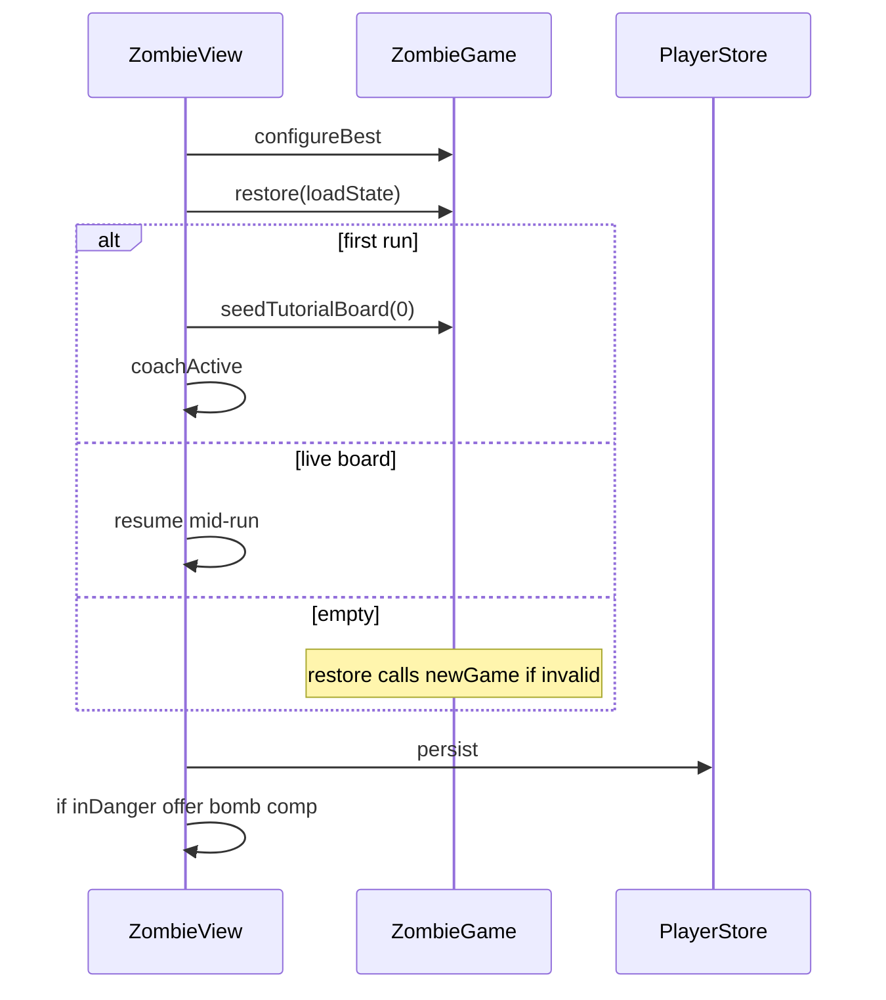
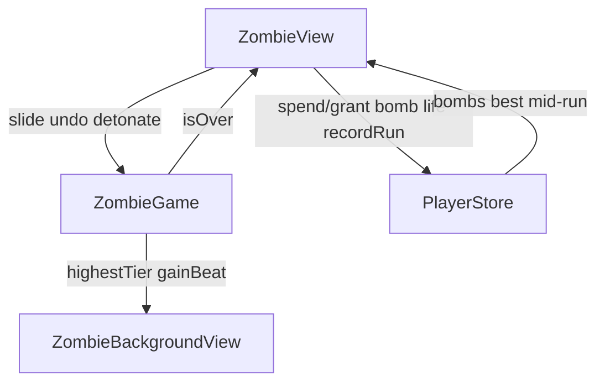

# Top Shelf (Zombie) — Code anatomy

Player-facing name: **Top Shelf**. Engine/id: **`zombie`**.

Primary sources (~2.3k LOC app modules):

| File | ~LOC | Role |
|------|------|------|
| `ZombieView.swift` | 1126 | UI: board, chrome, coach, bomb, win/lose |
| `ZombieBackgroundView.swift` | 677 | Bar-interior scenery driven by `ProgressPhase` |
| `ZombieGame.swift` | 457 | Pure 2048-family merge engine |

Tests: `ZombieAdversarialTests.swift`.  
Onboarding rubric: `ZOMBIE_ONBOARDING_RUBRIC.md`.  
Assets: `ZombieAssets/ZombieTile01…11`, trophy mug sprites, `ZombieIcon`.

---

## 1. Product shape in one paragraph

**Top Shelf** is a **4×4 merge pour** (2048 family). Swipes slide all drinks; equal tiers **merge once per swipe** into the next drink (value `1 << tier`). Each effective swipe **spawns** a new tier-1 (90%) or tier-2 (10%) pour — **20%** tier-2 while a **tier-8+** sits on the board (“Doubles After Midnight”). **THE ZOMBIE** is tier **11** (value 2048): a mid-run celebration, not the end. The run ends when **no swipe changes the board** (“last call” / bar full). Extras: **one undo per run**, wallet **Depth Charge** (2×2 clear, one-time house comp at danger), first-mix **drink lore** cards, depth milestones on max tier.

Wallet: `recordRun(…, earnScore: score/10)` — scores run hotter than other games.

---

## 2. File / type hierarchy

```
ContentView (route .zombie / Top Shelf)
└── ZombieView
    ├── @Environment PlayerStore     // lives, bombs, mid-run, milestones, GC
    ├── @State ZombieGame            // pure rules + session flags
    ├── ZombieBackgroundView(phase)
    ├── board (tiles, swipe, bomb reticle, burst/gain FX)
    ├── chrome (score, best, lives, UNDO, DEPTH CHARGE, how-to)
    ├── THE ZOMBIE banner / gold flash
    ├── first-mix lore card / doubles card
    ├── bomb ON THE HOUSE toast
    ├── CoachCard / READY TO MIX / HowToPlay
    ├── gameOverOverlay (LAST CALL)
    └── OutOfLives / Leaderboard

ZombieGame (@Observable)
├── Tile / Direction
├── slide / spawn / hasLegalMove
├── undo (one per run)
├── detonate (Depth Charge physics only)
├── inDanger / tutorial seeds
└── SavePayload restore

PlayerStore.zombieBombs / grantZombieBombIfNeeded / spendZombieBomb
```

### Ownership rule

| Concern | Owner |
|---------|--------|
| Merge math, spawn, undo snapshot, detonate cells | `ZombieGame` |
| Swipe gesture, refuse lean, lore, bomb targeting UI | `ZombieView` |
| Depth Charge **inventory** | `PlayerStore` (not the engine) |
| Lives, wallet, mid-run JSON | `PlayerStore` |
| Bar wall scenery | `ZombieBackgroundView` + `ProgressPhase` |

Engine **never** tracks bomb count — `detonate` only clears tiles; view spends the wallet charge.

---

## 3. Code blocks in `ZombieGame.swift`

### 3.1 Types & constants

| Block | Role |
|-------|------|
| `Tile` | `id`, `tier` 1…11, `col`, `row` |
| `Direction` | up / down / left / right (+ private `isHorizontal` / `fromFarEdge`) |
| `size` | 4 |
| `zombieTier` | 11 — THE ZOMBIE; **two ZOMBIEs never merge** |

### 3.2 Observable / session state

| Field | Role |
|-------|------|
| `tiles` / `score` / `best` / `isOver` | Core meters |
| `zombieReached` | Tier 11 ever mixed this run |
| `zombieCelebrated` | Banner dismissed / resumed past it |
| `lastMergedTier` / `justMerged` / `justSpawned` | Juice for one swipe |
| `lastGain` / `gainBeat` | Floating +N popup + scenery beat |
| `lastRunSummary` | Filled by view after `recordRun` |
| `loreSeen` | First-mix tiers already shown (persisted) |
| `doublesLive` / `doublesAnnounced` | Tier-8+ on board; toast once per run |
| `undoSnapshot` / `undoUsed` / `canUndo` | One rewind of last **effective** swipe |
| `bombBeat` / `lastBombedCells` | Detonation FX keys |
| `inDanger` | Live, not tutorial, tiles ≥ 14 (≤2 empties) |
| `tutorialActive` | Suppresses spawn + detonate |

### 3.3 Core algorithms

```
slide(direction) → Bool
  guard !isOver
  snapshot board for undo
  for each lane toward target edge:
    merge equal adjacent tiers once (tier < 11)
    score += 1 << newTier
    zombieReached if newTier == 11
  if nothing moved → false (no spawn, no undo write)
  commit tiles; record justMerged / lastGain
  if !tutorial: update best; spawn()
  if !hasLegalMove: isOver = true

spawn()
  free cell random
  tier 2 with p=0.1 (0.2 if doublesLive) else 1

hasLegalMove
  empty cell OR adjacent equal pair with tier < 11

detonate(col, row) → cleared count
  clamp top-left to 0…size-2; clear 2×2 hits
  no score, no spawn; kills undo snapshot
  0 if empty/tutorial/over (caller must not spend bomb)

undo()
  restore snapshot once; undoUsed = true; refuse after isOver
```

### 3.4 Scoring

| Event | Points |
|-------|--------|
| Merge to tier T | `+ (1 << T)` e.g. →4 is +8, →11 is +2048 |
| Depth Charge | 0 |
| Spawn | 0 |
| Wallet | `earnScore: score / 10` |

### 3.5 Tutorial (4 rounds)

| Round | Board | Goal |
|-------|-------|------|
| 0 | Two tier-1 in col 1 | DOWN → tier 2 |
| 1 | Two tier-2 | DOWN → tier 3 (lore Lime Daiquiri) |
| 2 | Two tier-3 | DOWN → tier 4 (lore Mai Tai) |
| 3 | Tier-4 + two tier-1s | **Any** successful swipe (swipe-teach) |

`endTutorial()`: clear flag, spawn twice. Score resets each seed.

### 3.6 Persistence

`SavePayload`: seenHowTo, score, board (nil if over), undoUsed, loreSeen.  
Restore validates no stack/overlap; clamps score; sets celebrated/doubles flags from board.

### 3.7 DEBUG seeds

`debugSeedBoard(maxTier:)`, `debugSeedDangerBoard()` (14-tile no-pair danger for bomb comp).

---

## 4. Code blocks in `ZombieView.swift`

### 4.1 Body ZStack (bottom → top)

1. `ZombieBackgroundView`  
2. `board` (swipe surface + tiles + bomb reticle)  
3. `chrome` (score chips, lives, undo, bomb, how-to)  
4. Gold wash (`zombieFlash`)  
5. Drink lore / after-midnight card  
6. Bomb comp toast  
7. **THE ZOMBIE** banner (if reached, not celebrated)  
8. `gameOverOverlay` if `isOver`  
9. Lives education / OutOfLives / Leaderboard  
10. Coach / READY TO MIX / HowToPlay  

### 4.2 MARK sections

| Section | Role |
|---------|------|
| lifecycle | `start`, restore, coach seed, staging hooks |
| interaction | `swipe`, tutorial advance, lore, doubles, zombie celebrate |
| board | layout, drag-to-swipe, bomb aim, tile views |
| chrome | UNDO, DEPTH CHARGE breathe, score chips |
| win + game over | banner + LAST CALL panel |
| helpers | `ZombieBurst`, `GainPopup`, `ZombieTileView` |

### 4.3 Swipe path

```
swipe(dir)
  if bombTargeting / howTo / over → return
  slide(dir) animated
  if !moved: refuse lean nudge; return
  tick SFX + slide haptic
  if merge:
    clear SFX by tier; merge haptic
    if tier 11: celebrateZombie (fanfare + gold flash + banner path)
    showLoreIfFirstMix; announceDoublesIfNeeded
    coach: handleTutorialMerge or dismiss on teach round
  else if coach teach: dismiss; else reseed pair
  persist; checkMilestones
  if isOver: finishRun
```

### 4.4 Finish run

```
finishRun
  gameOver SFX
  spendLifeForDefeat (not during tutorial/coach)
  recordRun(zombie, score, earnScore: score/10)
  persist
```

Panel why-line: **BAR FULL — NO MERGES LEFT**. CTA: MIX AGAIN / ALL GAMES.

### 4.5 Depth Charge (view + store)

| Step | Action |
|------|--------|
| Danger | `inDanger` → `grantZombieBombIfNeeded` once |
| UI | Breathe chip `×N`; targeting 2×2 reticle |
| Drop | `detonate` then `spendZombieBomb` only if cleared > 0 |

### 4.6 Scenery phase

Bar wall ladder by **highest tier on board**:

| Stage count | Tier threshold | Name (product) |
|-------------|----------------|----------------|
| 1 | 5 | DUSK BLINDS |
| 2 | 7 | NIGHT NEON |
| 3 | 9 | VOLCANO WATCH |
| 4 | 11 | THE ZOMBIE |

`tier` shelf stock = 1 + max loreSeen (lifetime). `beat` = `gainBeat`.

---

## 5. Drink ladder (player-facing)

| Tier | Value `1<<t` | Notes |
|------|----------------|-------|
| 1–2 | 2, 4 | Spawns |
| 3 | 8 | Lime Daiquiri lore |
| 4 | 16 | Mai Tai lore |
| 5–7 | 32…128 | Mid ladder |
| 8–10 | 256…1024 | Doubles After Midnight from 8+ |
| 11 | 2048 | **THE ZOMBIE** — keep playing |

---

## 6. Timeline — full lifecycle

### A. Enter (`start`)



### B. Coach (4 rounds)

1→2→3→4 by DOWN merges; round 3 any swipe; READY TO MIX → `endTutorial` + two spawns.

### C. Real play loop

```
idle
  → swipe | undo | bomb target → drop
  → slide/detonate/undo
  → spawn / juice / lore / doubles / zombie banner
  → if full + no merges: isOver → finishRun
  → persist mid-run
```

### D. THE ZOMBIE (mid-run)

Does **not** end the run. Banner + fanfare; CONTINUE sets `zombieCelebrated`. Keep mixing for score.

### E. Last call (game over)

Life spend (if lives) → wallet points → LAST CALL panel → MIX AGAIN (life gate) or exit.

---

## 7. Mental model



---

## 8. Staging / DEBUG env hooks

| Env | Effect |
|-----|--------|
| `TIKI_ZOMBIE_TUTORIAL` | Jump coach round |
| `TIKI_ZOMBIE_BOARD` | Seed max tier board |
| `TIKI_ZOMBIE_DANGER` | 14-tile danger board |
| `TIKI_ZOMBIE_SPAWNLOG` | Log spawn tiers |
| `TIKI_AUTOPLAY` / `_MS` | Random swipe bot |
| `TIKI_LB` | Force leaderboard |

---

## 9. Assets

- `ZombieTile01` … `ZombieTile11`  
- `ZombieTrophyMug` / glow  
- `ZombieIcon`  
- Preview poster / video for picker  

---

## 10. Related docs

| Doc | Use |
|-----|-----|
| `ZOMBIE_ONBOARDING_RUBRIC.md` | Coach bar |
| `TOTEM_ANATOMY.md` / `LUAU_ANATOMY.md` | Sibling format |
| Android twin | `android/.../zombie/ZombieGame.kt`, `TopShelfScreen.kt` |

---

*Generated from iOS source. Update alongside `ZombieGame` / `ZombieView` when behavior changes.*
