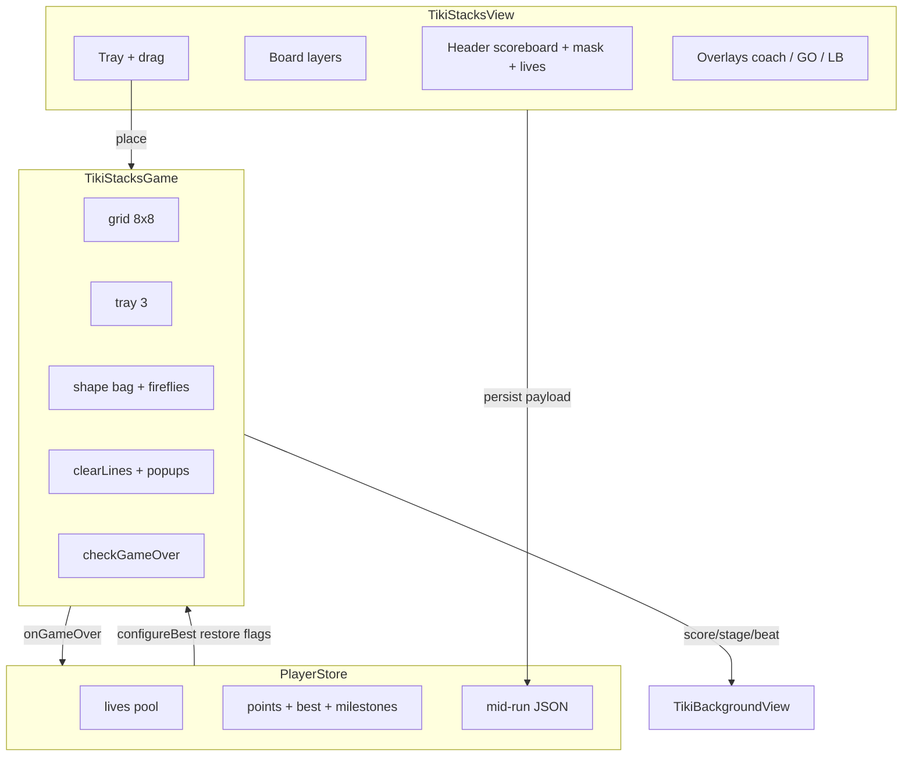

# Totem (Tiki Stacks) — Code anatomy

Player-facing name: **Totem**. Engine/id: **`tikiStacks`**.  
Primary sources: `TikiStacksGame.swift` (~632 LOC), `TikiStacksView.swift` (~1114 LOC).

This document defines every major code block, the view/engine hierarchy, and the
run timeline from launch through game over.

---

## 1. Product shape in one paragraph

Drag polyomino pieces from a **3-slot tray** onto an **8×8 board**. Filling any
**full row or full column** clears those lines for score. Combos streak across
back-to-back clears. The lagoon background deepens at score thresholds
(DUSK → NIGHTFALL → MOONRISE → GLOW TIDE). The run ends when **no remaining tray
piece has any legal placement** (“NO ROOM LEFT”). Shared lives/points/milestones
live outside the engine in `PlayerStore`.

---

## 2. File / type hierarchy

```
ContentView (route .tikiStacks)
└── TikiStacksView                    // UI shell, gestures, chrome, death beat
    ├── @Environment PlayerStore      // lives, points, mid-run, milestones, GC
    ├── @State TikiStacksGame         // pure rules + transient FX state
    ├── TikiBackgroundView(phase)     // lagoon scenery driven by ProgressPhase
    ├── header / board / trayView
    ├── dragOverlay
    ├── CoachCard / TutorialReadyBanner / HowToPlayPanel
    ├── OutOfLivesSheet / LeaderboardView / MilestoneToast
    └── gameOverOverlay

TikiStacksGame.swift
├── Assets: BlockColor, Image extensions (cells, frame, tray, masks, FX)
├── Model: GridPos, ScorePopup, Piece, PieceLibrary
└── TikiStacksGame (@Observable)
    ├── placement: canPlace, hasAnyPlacement, snappedOrigin, place
    ├── clearLines + popups + firefly / sweep / combo
    ├── bag deal: nextPiece, firefly glow
    ├── tutorial: seed / refill / endTutorialAndRefill
    ├── game over: checkGameOver → onGameOver
    └── persistence: SavePayload, payload(), restore()

Shared platform (not Totem-only, but on the call path)
├── PlayerStore.spendLifeForDefeat / recordRun / recordMilestone / saveState
├── TikiSound (tick / clear / fanfare / gameOver / win)
├── FirstRunCoach (CoachCard, CoachSkin.stacks, TutorialReadyBanner)
├── ProgressPhase → TikiBackgroundView
├── GameCenter.submitLive / loadStandings
├── LivesHearts, LeaderboardBar / LeaderboardView(theme: .totem)
└── OutOfLivesSheet, HowToPlay, SoftPressStyle, MilestoneToast
```

### Ownership rule

| Concern | Owner |
|---------|--------|
| Board legality, score math, tray bag, fireflies | `TikiStacksGame` |
| Drag, ghosts, haptics, death-beat timing, panels | `TikiStacksView` |
| Lives, wallet, best, mid-run string, milestones | `PlayerStore` |
| Scenery depth animation | `TikiBackgroundView` + `ProgressPhase` |
| SFX | `TikiSound.shared` (called from view + `onGameOver` hook) |

The engine **never** imports `PlayerStore`. It exposes `onGameOver: ((Int) -> Void)?`
and `lastRunSummary` for the view to fill after `recordRun`.

---

## 3. Code blocks in `TikiStacksGame.swift`

### 3.1 Assets

| Block | Type | Role |
|-------|------|------|
| `BlockColor` | enum | Six cell tints; each maps to `BlockCell*` asset |
| `Image` extensions | static | Empty well, board frame, tray, scoreboard, panel, button, burst, four mood masks, trophy/crown |

### 3.2 Model

| Block | Type | Role |
|-------|------|------|
| `GridPos` | struct | `(row, col)` cell address |
| `ScorePopup` | struct | Floating callout: text, fractional board pos, **tier** (0 point / 1–2 combo / 3+ banner) |
| `Piece` | struct | `id`, relative `cells`, `color`; computed `rows`/`cols` bounding box |
| `PieceLibrary.shapes` | static array | All polyomino templates (dots, lines, rects, corners, L, T, S/Z) |
| `PieceLibrary.piece(shapeIndex:)` | factory | Random color + new UUID |

### 3.3 Engine constants

| Constant | Value | Meaning |
|----------|-------|---------|
| `size` | 8 | Board dimension |
| `cleanSweepBonus` | 120 | Empty board bonus (pre-NIGHTFALL) |
| `moonlitSweepBonus` | 240 | Empty board from NIGHTFALL+ (`stage >= 2`) |
| `fireflyBonus` | 25 | Extra when a clear hits a firefly cell |
| `depthThresholds` | 150, 400, 800, 1500 | DUSK / NIGHTFALL / MOONRISE / GLOW TIDE |
| `snapRadius` | 1.25 | Max cell-distance for placement forgiveness |

### 3.4 Engine state (observable)

| Field | Role |
|-------|------|
| `grid` | `[[BlockColor?]]` 8×8; `nil` = empty |
| `tray` | `[Piece?]` length 3 |
| `score` / `best` / `streak` / `lastClearCount` | Scoring |
| `isGameOver` | Terminal flag |
| `stage` | Count of depth thresholds the score has crossed (0…4) |
| `clearBeat` | Cumulative clears → scenery flourish beat |
| `glowingPieceIDs` | Tray pieces currently firefly-tagged |
| `fireflyCells` | Board cells that retain glow until cleared |
| `clearFlash` / `clearCentroid` | Burst FX targets |
| `popups` | Active score callouts |
| `onGameOver` / `lastRunSummary` | Escape hatch to economy UI |
| `tutorialActive` | Suppresses bag refill + sweep/fanfare pollution |
| Bag internals | `bag`, `bagDealt`, `glowSlots`, `fireflyPerBag` |

### 3.5 Core algorithms

```
nextPiece()
  if bag empty: shuffle all shape indices; pick glowSlots by stage
  deal one shape; maybe tag glowingPieceIDs

canPlace(piece, origin)
  every relative cell in bounds and empty

hasAnyPlacement(piece)
  scan all origins

snappedOrigin(piece, idealRow, idealCol)
  round ideal → search 3×3 neighborhood clamped to board
  nearest legal within snapRadius (or nil)

place(slot, origin) → Bool
  stamp colors; if glowing piece → stamp fireflyCells
  score += cell count
  clear tray slot
  clearLines()
  if tray all nil and !tutorial → deal 3 nextPiece()
  updateBestIfNeeded(); checkGameOver()

clearLines()
  full rows + full cols → set of cells
  if none: streak = 0; return
  erase cells; streak++; clearBeat++
  points = lines * 10 * streak; score += points
  popups: +points, FIREFLY, COMBO, CLEAN/MOONLIT SWEEP, NEW BEST
  schedule clearFlash clear after 750ms (generation-guarded)

checkGameOver()
  if every non-nil tray piece has no placement:
    isGameOver = true
    popup "NO ROOM LEFT"
    onGameOver?(score)
```

### 3.6 Tutorial API

| API | Role |
|-----|------|
| `TutorialRound` | `boardFills`, `trayShapeIndex`, `dropOrigin` |
| `tutorialRounds` ×4 | Escalating 1→2→3→4 line clears (hand-authored gold boards, coral piece) |
| `seedTutorialBoard(round:)` | Wipe score, fill board, single tray piece |
| `refillTutorialTray(for:)` | Next round’s piece during clear-burst window |
| `endTutorialAndRefill()` | Clear tutorial flags, score 0, deal real bag |

### 3.7 Persistence

| API | Role |
|-----|------|
| `SavePayload` | seenHowTo, score, streak, board, tray, fireflies, glowingTray, seenDangerTip |
| `payload(...)` | JSON; board/tray **nil** if game over (no zombie resume) |
| `restore(from:)` | Validate size/tray; clamp score/streak; return flags for view |

### 3.8 DEBUG only

`debugRedealTray`, `debugValidateSnapping`, `debugBotBatch`, `debugSeedSweepBoard` — staging / snap proof / threshold calibration.

---

## 4. Code blocks in `TikiStacksView.swift`

### 4.1 View state (UI-only)

| State | Role |
|-------|------|
| `dragSlot` / `dragLocation` | Active drag |
| `boardInner` | Board rect in `"game"` coordinate space |
| `coachActive` / `tutorialRound` / `readyBannerActive` | FTUE |
| `howToOpen` / `seenHowTo` | How-to modal |
| `dangerGlow` / `dangerTipActive` / `seenDangerTip` | Full-board warning |
| `panelShown` / `trayShake` | Death beat (~1.4s then panel) |
| `checkedBits` / `mintedThisRun` / `lanternEarned` | Milestone UI |
| `leaderboardOpen` / `totemStandings` | Totem Pole LB |
| `outOfLivesOpen` / spend break / `livesEducationActive` | Lives UX |
| `scoreReactArmed` | Prevent restore from firing place SFX |

### 4.2 Body ZStack layers (bottom → top)

1. `TikiBackgroundView(phase: scenePhase)` — lagoon depth  
2. `VStack`: **header** · **board** · **tray** · spacer  
3. `dragOverlay` — full-size floating piece (−80pt lift)  
4. `gameOverOverlay` if `panelShown`  
5. Danger tip toast  
6. `CoachCard` if coaching  
7. `TutorialReadyBanner` “READY TO STACK”  
8. `HowToPlayPanel` “HOW TO STACK”  
9. Lives education toast  
10. `OutOfLivesSheet`  
11. `LeaderboardView(theme: .totem)`  

Coordinate space: `"game"` (shared by drag + board geometry).

### 4.3 MARK sections

| Section | Functions | Role |
|---------|-----------|------|
| lifecycle | `start`, milestones, persist, danger tip, spend break, coach dismiss, tutorial place, scoring SFX, autoplay | Enter + economy hooks |
| header | `header`, `maskView` | Scoreboard plaque, lives chip, mood mask, how-to |
| board | `board`, `gridCells`, `ghostCells`, `flashCells`, `coachCellPulse`, `dangerRim`, `popupLayer`, `ghostOrigin` | 8×8 playfield layers |
| tray | `trayView`, `dragGesture` | 3 slots + drag |
| drag overlay | `dragOverlay` | Finger piece |
| game over | `gameOverOverlay` | Payoff panel |
| helpers | `FireflyDot`, `BoardFrameHole`, `PopupText`, `BurstView`, `PieceView` | Local rendering atoms |

### 4.4 Board layer stack (inside frame)

```
BoardFrame image (masked with BoardFrameHole)
└── translucent cream field
    ├── empty wells + BlockColor images + FireflyDot
    ├── ghost placement (blossom tint) while dragging
    ├── BurstView cascade from clearCentroid
    ├── ScorePopup / PopupText
    ├── danger coral rim (fillRatio high)
    └── coach pulse + arrow on tutorial target cell
```

### 4.5 Drag → place path

```
DragGesture(minimumDistance: 0, coordinateSpace: .named("game"))
  onChanged: set dragSlot + dragLocation
  onEnded:
    ghostOrigin = snappedOrigin(ideal from finger − 80pt lift)
    if nil: cancel
    place(slot, origin) with spring
    if clear: clearHaptic; maybe fanfare on clean sweep
    else: placeHaptic
    if coach: handleTutorialPlacement
    persist()
```

Ghost math: piece center under finger with **−80pt Y lift** so the hand doesn’t cover the landing cells; ideal top-left fractional → `snappedOrigin`.

---

## 5. Scoring formula (exact)

| Event | Points |
|-------|--------|
| Place piece | `+piece.cells.count` |
| Clear L lines with streak S | `+ L * 10 * S` (`S` increments each clear in a row; resets to 0 on place with no clear) |
| Firefly cell in clear | `+25` once per clear if any firefly cell in set |
| Clean sweep (board empty, not tutorial) | `+120` or `+240` if `stage >= 2` (NIGHTFALL+) |
| Depth milestone (store) | `+75` wallet once per bit (not board score) |
| Run wallet (store) | `max(1, score/10)` points (+ milestone mints) |

**Lose condition:** after a place, every remaining tray piece fails `hasAnyPlacement`.  
Empty tray never ends the game mid-clear — tray refills when all three slots empty (real play).

---

## 6. Depth / scenery ladder

| Stage index | Threshold | Name | Engine effects |
|-------------|-----------|------|----------------|
| 0 | — | Pre-dusk | No fireflies in bag |
| 1 | 150 | DUSK | Milestone bit 0 |
| 2 | 400 | NIGHTFALL | 1 firefly/bag; moonlit sweep |
| 3 | 800 | MOONRISE | Milestone bit 2 |
| 4 | 1500 | GLOW TIDE | 2 fireflies/bag; permanent lantern (`tier` on ProgressPhase) |

`scenePhase` fed to background:

```swift
ProgressPhase(
  stage: game.stage,
  depth: min(1, score / 1500),
  tier: lanternEarned ? 1 : 0,
  beat: game.clearBeat
)
```

---

## 7. Mood mask

| Mood | Condition |
|------|-----------|
| sleepy | game over |
| surprised | last clear ≥ 2 lines |
| grumpy | fill ratio > 0.6 |
| happy | default |

---

## 8. Timeline — full run lifecycle

### A. Enter (`onAppear` → `start()` once)

```mermaid
sequenceDiagram
  participant V as TikiStacksView
  participant G as TikiStacksGame
  participant S as PlayerStore
  V->>G: configureBest(store.best)
  V->>G: restore(store.loadState)
  alt first run and not onboardingSkipped
    V->>G: seedTutorialBoard(0)
    V->>V: coachActive = true
  end
  V->>G: onGameOver = spendLife + recordRun + gameOver SFX
  V->>S: persist()
  V->>V: checkMilestones; arm scoreReact
```

1. Load persisted best into engine.  
2. Restore mid-run board/tray if valid live payload.  
3. If never seen how-to and onboarding not skipped → **coach path** (round 0).  
4. Wire `onGameOver` closure (sound, life spend, `recordRun` → `lastRunSummary`).  
5. Save state; arm SFX so restore doesn’t “pop”.

### B. Coach path (four rounds)

| Round | Lines taught | Board setup (summary) | Piece |
|-------|--------------|------------------------|-------|
| 0 | 1 row | Row 4 almost full | 1×1 at (4,7) |
| 1 | row+col | Row 4 + col 7 almost full | 1×1 at (4,7) |
| 2 | 3 lines | Rows 3–4 + col 7 | vertical 2 at (3,7) |
| 3 | 4 rows | Rows 2–5 almost full | vertical 4 at (2,7) |

Per successful clear:

1. `refillTutorialTray` for next piece (no empty flash).  
2. Wait ~520ms for burst.  
3. Advance round or `dismissCoach(success:)` → READY banner → `endTutorialAndRefill()` → real bag.  
4. SKIP → `store.skipOnboarding()`, same handoff without banner fanfare path.

Score resets each `seedTutorialBoard` so scripted clears **cannot** mint DUSK (150).

### C. Real play loop

```
idle tray
  → drag piece (ghost + lift)
  → drop on snapped origin (or cancel)
  → place: stamp, score cells, clearLines?
       yes → streak++, popups, bursts, clear haptic, depth check, danger tip?, milestones?
       no  → streak = 0, place haptic
  → tray empty? deal 3 from bag (fireflies by stage)
  → any piece unplaceable? → GAME OVER path
  → persist mid-run
```

Parallel observers on score:

- `reactToScoring` — SFX ladder / board shake  
- `checkMilestones` — first cross of 150/400/800/1500  
- `checkDangerTip` — one-shot toast at fill ≥ 0.72  
- `GameCenter.submitLive`

### D. Death beat → panel

```
checkGameOver
  → isGameOver = true
  → popup "NO ROOM LEFT"
  → onGameOver(score)
       → TikiSound.gameOver()
       → spendLifeForDefeat (unless tutorial)
       → lastRunSummary = recordRun(...)
  View onChange(isGameOver):
       → trayShake 8 → spring 0
       → wait 1400ms
       → panelShown = true (scrim + uiPanel)
       → load GC standings for Totem Pole
  View onChange(livesSpendCount):
       → arm heart break animation
       → maybe lives education toast
```

### E. Panel actions

| Button | Behavior |
|--------|----------|
| ALL GAMES | `onExitRequested` → picker |
| PLAY AGAIN | If out of lives → `OutOfLivesSheet`; else `restartAfterGate()` → `game.restart()`, reset UI counters, persist |
| Leaderboard bar | Totem Pole overlay |

Payoff content: NEW BEST vs GAME OVER, why-line **NO PIECE FIT THE BOARD**, score, best, `+points`, wallet, optional NEW ITEM teaser, milestone toast if mints this run.

### F. Exit / background

`persist()` on place and start writes mid-run JSON via `PlayerStore.saveState`.  
Game-over payload clears board/tray (resume only live runs).

---

## 9. Tutorial vs real play differences

| Behavior | Tutorial | Real |
|----------|----------|------|
| Tray refill | Manual scripted piece | Bag of all shapes |
| Score across rounds | Reset each seed | Continuous |
| Clean sweep fanfare | Suppressed | Fanfare + bonus |
| Life spend | Never | On real defeat |
| Best update | Suppressed in engine | Updates when score > best |
| How-to / danger tip | Coach owns education | How-to button + danger toast |

---

## 10. Asset catalog (Totem-relevant)

Under `Assets.xcassets` / stacks image sets:

- `BlockCellCoral|Teal|Gold|Orange|Avocado|Chartreuse|Empty`
- `BoardFrame`, `UITray`, `UIScoreboard`, `UIPanel`, `UIButton`
- `FXBurst`, `MaskHappy|Surprised|Grumpy|Sleepy`
- `IconTrophy`, `IconCrown`
- Preview: `Previews/preview-stacks.mp4`, `poster-stacks.png`
- Icon: `TikiStacksIcon`

---

## 11. Staging / debug env hooks

| Env | Effect |
|-----|--------|
| `TIKI_STACKS_SCORE` | Seed score + redeal tray |
| `TIKI_STACKS_SWEEP` | Full board minus (4,7) + dot |
| `TIKI_STACKS_SNAPTEST` | Print snap unit assertions |
| `TIKI_STACKS_BOT` | Greedy bot score distribution |
| `TIKI_STACKS_HOWTO` | Force how-to open |
| `TIKI_STACKS_TUTORIAL_AUTOPLAY` | Auto-place coach targets |
| `TIKI_LB` (+ mock variants) | Force leaderboard overlay |
| `TIKI_AUTOPLAY` | Bot play (view path) |

---

## 12. Related tests & rubrics

- `TikiGamesTests/TikiStacksAdversarialTests.swift`
- `STACKS_SNAP_RUBRIC.md`, `STACKS_ROTATION_RUBRIC.md` (if present)
- `ONBOARDING_RUBRIC.md`, `POST_TUTORIAL_REVEAL_RUBRIC.md`
- `GAME_FEEL_RUBRIC.md`
- Android twin: `android/core/.../totem/TotemGame.kt` + `TotemScreen.kt`

---

## 13. Mental model (one diagram)



---

*Generated from source as of the Totem twin documentation pass. When behavior changes, update this file alongside `TikiStacksGame` / `TikiStacksView`.*
